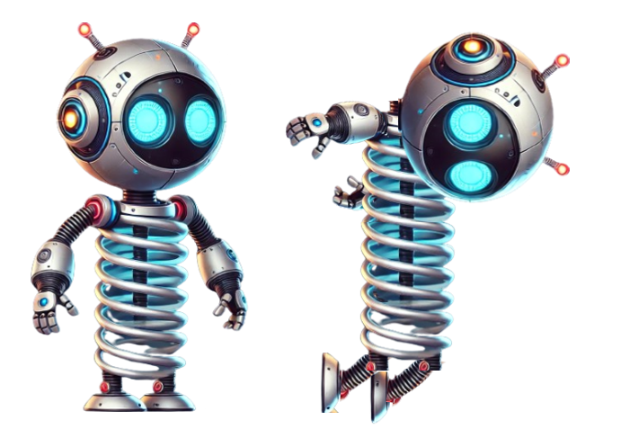

# Game Design Document (GDD)

### 1. Portada

### Título del juego:
Dreams of Liberty

### Versión: 
1.0

### Fecha: 
30 de Junio de 2024

### Autor: 
Paúl Román

### 2. INDICE

1. [Primer apartado](#id1)

2. [Índice](#id2)

3. [Visión General del Juego](#id3)

   3.1. [Descripción](#id31)

   3.2. [Objetivo](#id32)

   3.3. [Género](#id33)

   3.4. [Plataformas](#id34)

   3.5. [Público Objetivo](#id35)

   3.6. [Inspiración e Influencias](#id36)

   3.7. [Modelo de negocio](#id37)

4. [Mecánicas del Juego](#id4)

   4.1. [Descripción General de la Jugabilidad](#id41)

   4.2. [Controles](#id42)

   4.3. [Mecánicas](#id43)

5. [Mundo del Juego](#id5)

   5.1. [Historia](#id51)

   5.2. [Descripción del Mundo](#id52)

   5.3. [Mapas y Niveles](#id53)

   5.4. [Personajes](#id54)

6. [Estética del Juego](#id6)

   6.1. [Estilo Visual](#id61)

   6.2. [Diseño de Personajes](#id62)

   6.3. [Diseño de Niveles](#id63)

### 3. Visión General del Juego

#### 3.1 Descripción

"Dreams of Liberty" es un juego de plataformas en 2D protagonizado por Roby, un robot saltarín que posee un resorte en su cuerpo. Los jugadores controlan a Roby a través de diversos niveles llenos de obstáculos, enemigos y desafíos, utilizando sus habilidades de salto para avanzar y liberar a otros robots atrapados.

#### 3.2 Objetivo

El objetivo del juego es completar todos los niveles liberando a los robots atrapados y recogiendo todas las piezas de energía dispersas a lo largo del camino, mientras se evita a los enemigos y se superan los obstáculos.

#### 3.3 Género

Juego de plataformas en 2D

#### 3.4 Plataformas

PC, Consolas (PlayStation, Xbox, Nintendo Switch), Móvil (iOS y Android)

#### 3.5 Público Objetivo

El juego está dirigido a jugadores de todas las edades, especialmente a aquellos que disfrutan de juegos de plataformas clásicos y desafiantes, tanto casuales como dedicados.

#### 3.6 Inspiración e Influencias

El juego se inspira en títulos clásicos de plataformas como "Super Mario Bros", "Mega Man", y "Sonic the Hedgehog", así como en juegos más recientes como "Celeste" y "Hollow Knight".

#### 3.7 Modelo de negocio

El juego se venderá mediante un modelo de compra única, con posibles expansiones y contenido descargable (DLC) en el futuro.

### 4. Mecánicas del Juego

#### 4.1 Descripción General de la Jugabilidad

El jugador controla a Roby a través de niveles llenos de plataformas, enemigos y obstáculos. Roby tiene la capacidad de saltar y rotar dependiendo de sus interacciones con el medio. Roby tiene dos posiciones una horizontal y otra vertical. Como se ve en la iamgen:

Al estar en horizontal no está a favor de su resorte por tanto su capacidad de salto se ve reducida, por otro lado al estar de pie puede alcanzar grandes alturas. El objetivo es avanzar por el nivel y liberar a otros robots mientras se evitan peligros y enemigos.

#### 4.2 Controles

• Tecla de dirección (flechas o WASD): Moverse
• Barra espaciadora: Saltar

#### 4.3 Mecánicas

- Saltos: Roby puede realizar un salto normal.
- Rebote en las paredes: Roby puede rotar dependiendo de su interaccion con el medio pudiendo terminar en posicion horizontal o vertical
- Variación de salto: Roby en posicion vertical salta un 30% más que estando en posicion horizontal al estar a favor del resorte de su cuerpo.
- Liberación de robots: Encuentra y libera a otros robots atrapados para avanzar en la historia.
- Enemigos y obstáculos: Evita enemigos y obstáculos que dificultan el avance.

### 5. Mundo del Juego

#### 5.1 Historia

En un futuro distante, la humanidad ha dejado la Tierra y ha construido robots para mantener el planeta. Roby, un robot saltarín, despierta en un mundo donde sus compañeros robots han sido capturados por una entidad maligna. Roby debe liberar a sus amigos y restaurar la libertad en su mundo.

#### 5.2 Descripción del Mundo

El mundo del juego es un entorno futurista lleno de fábricas abandonadas, bosques tecnológicos y ciudades robotizadas. Cada nivel tiene una estética única y está lleno de detalles que crean una atmósfera inmersiva.

#### 5.3 Mapas y Niveles

• Fábrica Abandonada: Un entorno industrial lleno de máquinas oxidadas y plataformas en movimiento.
• Bosque Tecnológico: Un bosque lleno de árboles cibernéticos y trampas ocultas.
• Ciudad Robotizada: Una ciudad futurista con edificios altos y luces de neón.

#### 5.4 Personajes

• Roby: El protagonista, un robot saltarín con un resorte en su cuerpo.
• Robots capturados: Compañeros de Roby que deben ser liberados.
• Entidad Maligna: El antagonista del juego que ha capturado a los robots.

### 6. Estética del Juego

#### 6.1 Estilo Visual

• Estilo artístico: Gráficos en 2D con una estética futurista y caricaturesca.
• Paleta de colores: Colores brillantes y contrastantes para destacar los entornos y personajes.

#### 6.2 Diseño de Personajes

• Roby: Un robot con un diseño amigable y resorte en su cuerpo.
• Robots capturados: Cada uno con un diseño único y características distintivas.
• Entidad Maligna: Un diseño oscuro y amenazante para contrastar con los personajes amigables.

#### 6.3 Diseño de Niveles

• Fábrica Abandonada: Plataformas en movimiento, máquinas oxidadas y caminos llenos de trampas.
• Bosque Tecnológico: Árboles cibernéticos, plataformas ocultas y trampas naturales.
• Ciudad Robotizada: Edificios altos, luces de neón y caminos llenos de obstáculos tecnológicos.